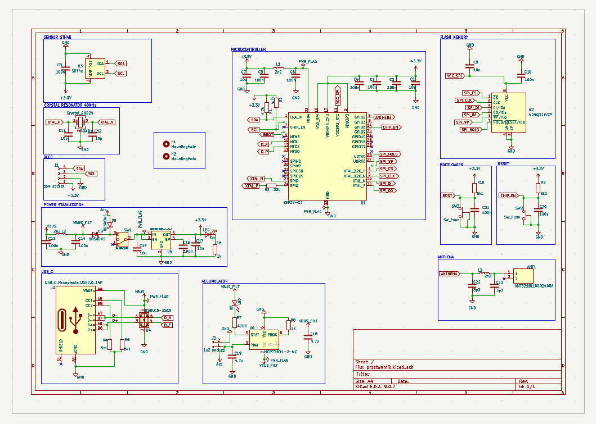

# Wireless Environmental Parameter Transmitter

A professional, compact IoT solution for high-precision environmental monitoring based on the **ESP32-C3** (RISC-V) architecture. This project integrates sensing, power management, and local visualization into a single PCB.

---

## Overview

This device is designed to measure, display, and transmit environmental data (Temperature & Humidity) over Wi-Fi or Bluetooth LE. It features a robust power circuit, making it suitable for battery-operated remote applications.

### Key Features
* **Microcontroller:** ESP32-C3 with 2.4GHz Wi-Fi and BLE 5.0.
* **High-Precision Sensing:** Integrated **SHT45** sensor for accurate climate data.
* **Display Support:** Dedicated I2C header for OLED displays (SSD1306/SH1106).
* **Power System:** USB-C connectivity for power and programming.
    * Li-ion/Li-Po battery charging via **NCP73831**.
    * Battery voltage sensing for level monitoring.
* **User Interface:** Physical buttons for `Reset` and `Boot`.

---

## Hardware Specifications

The schematic was developed using **KiCad 9.0**. Key circuit blocks include:

* **RF Section:** Optimized antenna matching network for the 2.4GHz band.
* **Power Rail:** Stable 3.3V LDO regulator with decoupling capacitors for noise reduction.
* **Protection:** ESD protection on the USB-C data lines (D+/D-).
* **Flash Memory:** External SPI Flash for extended data logging or complex firmware.

---

## License

This project is open-source. You are free to modify and distribute it for personal or commercial use.

  

